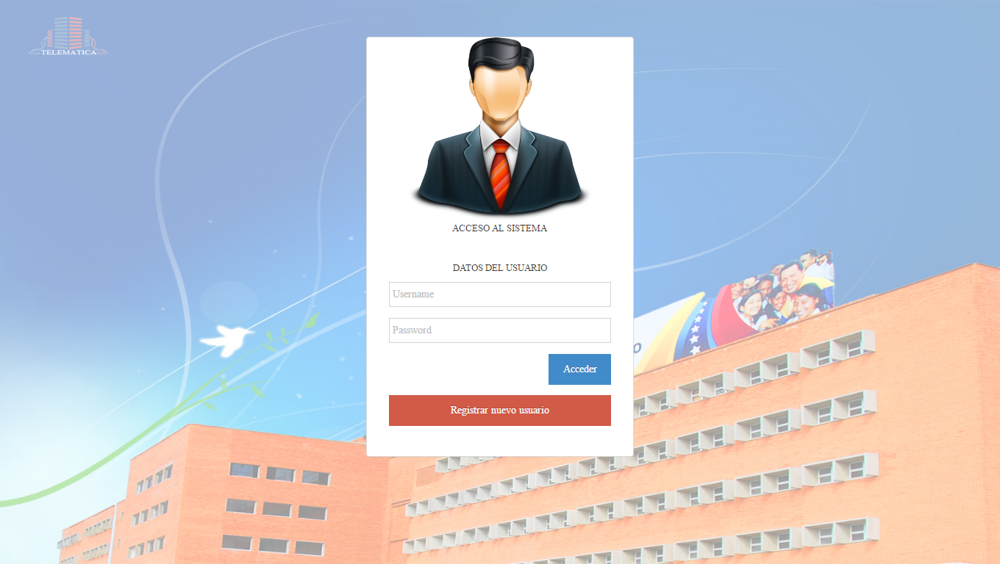

# (SIBDES) Sistema de informacion para banco de sangre

Lo que necesitas modificar:


- conexiones/Connection.php

```conexiones/Connection.php
<?php
function dbConnect (){
 	  $conn =	null;
 	  $host = 'localhost';
      $db   = 'nombre_base_de_datos';
      $user = 'usuario_base_de_datos';
      $pwd  = 'clave_de_base_de_datos';
	try {
	   	$conn = new PDO('mysql:host='.$host.';dbname='.$db, $user, $pwd);
		}
	catch (PDOException $e) {
		echo '<p>NO SE HA PODIDO CONECTAR A LA BASE DE DATOS!!</p>';
       
	    exit;
	}
	return $conn;
 }
 function desconectar() {
      $conn = null;
   }
 ?>

```



